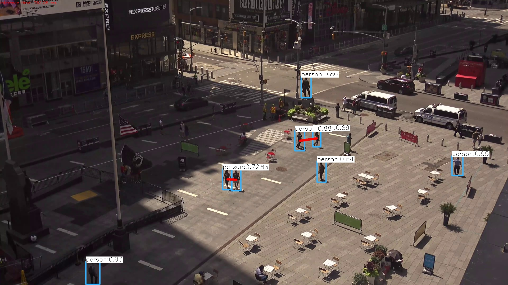

This repo acts as open source python implementation to the demo porposed by landingAI

By some cause other repos about this has been deleted, we do not own any rights about original project, any right issues send us an email: hola@cloudmex.io

## New stuffs around this
We have added an flask web server for visualize results on real time.
Flask-based API is available for making predictions for youtube videos.

## How to use the repo

### 1.clone the repo

### 2. Install dependencies (recommended in virtual environment)

```
virtualenv -p python3 venv
source venv/bin/activate
pip install -r requirements.txt
```

###  3.download YOLOV3 pretrained weights and architecture

```
mkdir yolo_weights
cd yolo_weights
wget https://pjreddie.com/media/files/yolov3.weights
wget https://raw.githubusercontent.com/pjreddie/darknet/master/cfg/yolov3.cfg
wget https://raw.githubusercontent.com/pjreddie/darknet/master/data/coco.names
```
Note: this code recovers weights from AWS S3 bucket, you can avoid any error related to this downloading the weights the way are mentioned on this step.
### 4.run the code

```
export FLASK_APP=application.py
# or you can use export FLASK_APP=api.py
flask run
```

## Use detection API.
```
curl -d '{"payload":"https://www.youtube.com/watch?v=mRe-514tGMg"}' http://127.0.0.1:5000/ --output detect.jpg
```

## check sample result of the implementation



## Citation

```
@article{yolov3,
  title={YOLOv3: An Incremental Improvement},
  author={Redmon, Joseph and Farhadi, Ali},
  journal = {arXiv},
  year={2018}
}
```
